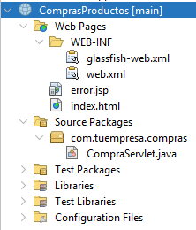

## 📥 Cómo clonar y ejecutar este proyecto en otra PC

Sigue los pasos detallados a continuación para descargar y ejecutar correctamente este proyecto en otra computadora:

---

### ✅ 1. Instalar Java 17

- Descarga Java 17 desde:  
  https://adoptium.net/en-GB/temurin/releases/?version=17&os=any&arch=any 
- Instálalo y verifica la instalación con el siguiente comando:

```bash
java -version
```

> Debe mostrar: `java version "17.0.x"`

---

### 🧰 2. Instalar NetBeans 26

- Descárgalo desde:  
  [https://netbeans.apache.org/download/](https://netbeans.apache.org/download/)
- Asegúrate de incluir el **soporte para Jakarta EE / Java Web** durante la instalación.

---

### 🌐 3. Instalar y configurar GlassFish 7.0.24

- Guía completa de instalación por donde me guie para la configuracion del proyecto:  
  [https://avbravo-2.gitbook.io/jakartaee/glassfish-server/instalar-glassfish](https://avbravo-2.gitbook.io/jakartaee/glassfish-server/instalar-glassfish)

- Instalar la opcion que dice:

  "Eclipse GlassFish 7.0.24, Jakarta EE Platform, 10 (zip)"

  1. Descomprimir el zip y continuar con los pasos de la guia completa, usando el terminal  

## 🖥️ Configurar GlassFish desde la terminal (opcional)

Si deseas configurar GlassFish rápidamente desde la terminal, puedes crear un dominio sin contraseña para facilitar el ingreso y pruebas locales.

### 🔧 Activar el servidor:

1. Abre tu terminal o PowerShell.
2. Navega a la carpeta de instalación de GlassFish. Por ejemplo:

```bash
cd C:/glassfish7/glassfish/bin
```

3. Crea un nuevo dominio sin contraseña con el siguiente comando:

```bash
asadmin create-domain --user admin --nopassword true --savelogin true domain1
```

Esto creará un dominio llamado `domain1` sin necesidad de ingresar contraseña cada vez.

4. Inicia el dominio con:

```bash
asadmin start-domain domain1
```

5. Puedes detenerlo más tarde con:

```bash
asadmin stop-domain domain1
```

Pasos básicos:

1. Abre NetBeans y ve a `Servicios > Servidores`.
2. Haz clic derecho en "Servidores" > **Agregar Servidor**.
3. Selecciona **GlassFish Server** y localiza la carpeta donde instalaste `glassfish7`.
4. Usa el dominio `domain1`.
5. Usuario por defecto: `admin`.

---

### 📂 4. Clonar o descargar el proyecto

Puedes obtener el proyecto de dos formas:

#### 🔀 Opción A: Clonar con Git

```bash
git clone https://github.com/oFrank777/LAB-6-SD.git
```

#### 📦 Opción B: Descargar como ZIP

1. Ve a la página del repositorio en GitHub.
2. Haz clic en **Code > Download ZIP**.
3. Extrae el contenido en tu carpeta de proyectos.

---

### 📦 5. Abrir el proyecto en NetBeans

1. Abre **NetBeans 26**.
2. Ve a `Archivo > Abrir Proyecto`.
3. Navega hasta la carpeta `ComprasProductos` y selecciónala.
4. Espera a que NetBeans cargue el proyecto y sus dependencias correctamente.

---

### ⚙️ 6. Configurar GlassFish como servidor del proyecto

1. Haz clic derecho sobre el proyecto `ComprasProductos` > **Propiedades**.
2. En la sección **Ejecutar**, asegúrate de configurar:
   - **Servidor:** `GlassFish Server 7.0.24`
   - **Contexto:** `/ComprasProductos`

---

### 🚀 Tree del Proyecto



### 🚀 7. Ejecutar el proyecto

1. Haz clic derecho sobre el proyecto > **Ejecutar** o **Deploy**.
2. Abre tu navegador y accede a:

```
http://localhost:8080/ComprasProductos/
```

---

### ❗ Si algo no funciona

- Verifica que el **JDK seleccionado** en NetBeans sea Java 17.
- Verifica que **GlassFish esté iniciado correctamente**.
- Asegúrate de que **la estructura del proyecto esté intacta**.

---


